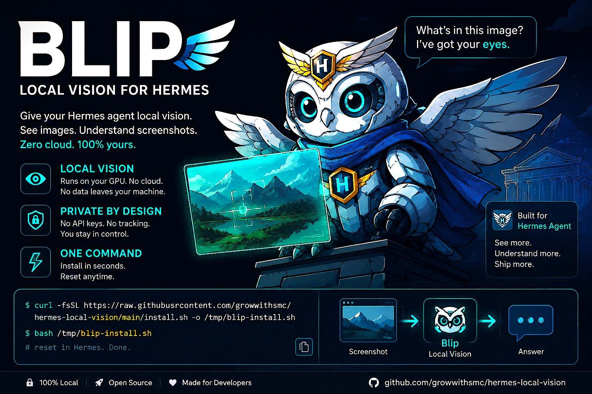

# Blip - Local Vision for Hermes Agent

<p align="center">
  
</p>

<p align="center">
  <strong>Give your Hermes agent eyes.</strong><br>
  No cloud. No API keys. No setup fuss.<br>
  One command install. GPU auto-detected. Model auto-downloaded.<br>
  <em>Your grandma could set this up.</em>
</p>

<p align="center">
  <a href="https://github.com/NousResearch/hermes-agent"></a>
  <a href="https://github.com/growwithsmc/hermes-local-vision"></a>
  <a href="https://github.com/growwithsmc/hermes-local-vision/blob/main/LICENSE"></a>
  
  
  
</p>

---

**Blip** gives your Hermes agent local vision - it runs a VLM on your own GPU
so you can paste screenshots, photos, or diagrams and get actual image analysis
without sending data to the cloud.

## Install

### One-liner (Hermes plugin)

```bash
hermes plugins install growwithsmc/hermes-local-vision
hermes plugins enable blip-vision
# Restart Hermes. Done.
```

On first load, the plugin automatically detects your GPU, downloads a pre-built
llama-server binary, downloads the right vision model for your VRAM, configures
Hermes, and starts the server. Everything. Zero manual steps.

### Raw install script

Prefer not to use the plugin system? The classic install script still works:

```bash
curl -fsSL https://raw.githubusercontent.com/growwithsmc/hermes-local-vision/main/install.sh -o /tmp/blip-install.sh
less /tmp/blip-install.sh
bash /tmp/blip-install.sh
# Then follow the printed instructions to add to config.yaml
# /reset in Hermes. Done.
```

The install script clones and builds llama.cpp from source, downloads the
SmolVLM model, generates an auth key, and starts the server.

## From inside Hermes

```bash
/blip setup     # Full auto-setup (download, configure, start)
/blip status    # Is it running?
/blip stop      # Free up VRAM
/blip start     # Start it back up
/blip key       # Show API key
```

Or just tell Hermes: *"Set up local vision for me"* - the agent runs `/blip setup`.

## What you get

| Feature | What it does |
|---------|-------------|
| 🖼️ **Image analysis** | Paste any image, ask about it. Works with `vision_analyze` and `browser_vision`. |
| 🧠 **Conversation context** | The vision model sees your last 3 messages - no more guessing what you're looking for. |
| 📸 **Multi-image** | Drop 10 screenshots. The proxy splits them into sequential calls automatically. |
| 📦 **Auto compression** | Large images are intelligently resized (max 2048px, quality 85). Fine details preserved. |
| 🔒 **Private** | Everything runs on your GPU. Zero data leaves your machine. |
| 🚀 **Fast** | Prompt caching: repeat images analyze in ~4s instead of ~8s. |
| 💤 **Auto-sleep** | Idle shutdown frees VRAM. Restarts on demand. |

## How it works

```
You paste an image
  → Hermes calls vision_analyze
    → vision-context plugin adds last 3 messages as context
      → BLIP auth proxy (port 11788)
        → Compresses large images
        → Splits >3 images into sequential calls
          → llama-server (port 11789, Qwen2.5-VL-7B)
            → Returns analysis with conversation awareness
```

**The stack:** [llama.cpp](https://github.com/ggml-org/llama.cpp) →
[Qwen2.5-VL-7B](https://huggingface.co/ggml-org/Qwen2.5-VL-7B-Instruct-GGUF)
(or auto-picked model) → your GPU.

## Auto model selection

| VRAM | Model | Quality |
|------|-------|---------|
| <4 GB | SmolVLM 2B | Basic - fast, lightweight |
| 4-8 GB | Gemma 3 4B | Good balance |
| 8+ GB | Qwen2.5-VL-7B | Excellent - recommended |

The plugin picks the best model for your hardware automatically.
Override with `BLIP_HF_REPO` env var.

## Requirements

- Python 3.9+ (for the auth proxy)
- A GPU (NVIDIA recommended, CPU works too)
- 5 GB free disk for the model
- [Hermes Agent](https://github.com/NousResearch/hermes-agent)

## Config reference

Everything is optional. These are the defaults:

```yaml
auxiliary:
  vision:
    provider: openai
    mode: context                    # "stateless" or "context"
    context_messages: 3             # conversation turns to include
    model: Qwen2.5-VL-7B-Instruct-Q4_K_M.gguf
    base_url: http://127.0.0.1:11788/v1
    api_key: "<auto-generated>"
    timeout: 120
```

Environment variables:

| Var | Default | What it does |
|-----|---------|-------------|
| `BLIP_PORT` | 11788 | Server port |
| `BLIP_MAX_IMAGE_SIZE` | 1048576 | Max bytes before compression |
| `BLIP_MAX_IMAGE_DIMENSION` | 2048 | Max pixels (preserves aspect ratio) |
| `BLIP_IMAGE_QUALITY` | 85 | JPEG quality |
| `BLIP_MAX_IMAGES_PER_SEQUENCE` | 3 | Sequential split threshold |
| `BLIP_IDLE_TIMEOUT` | 90 | Minutes before auto-shutdown (0 = indefinite) |
| `BLIP_CONTEXT_SIZE` | 8192 | Context window (tokens) |
| `BLIP_HOST` | 127.0.0.1 | Bind address |
| `BLIP_MODEL_DIR` | ~/.hermes/models/blip | Model directory |
| `BLIP_MODEL_FILE` | *auto* | Model GGUF filename |
| `BLIP_MMPROJ_FILE` | *auto* | MMProj GGUF filename |
| `BLIP_LLAMA_BIN` | *auto* | Path to llama-server binary |
| `BLIP_SCRIPTS_DIR` | ~/.hermes/scripts | Scripts directory |
| `BLIP_PID_FILE` | ~/.hermes/scripts/blip-server.pid | PID file path |
| `BLIP_AUTH_KEY_FILE` | ~/.hermes/scripts/blip-auth.key | Auth key file path |
| `BLIP_ACTIVITY_FILE` | ~/.hermes/scripts/blip-last-used | Activity timestamp path |
| `BLIP_IMAGE_MIN_TOKENS` | -1 | Min image tokens (-1 = auto) |
| `BLIP_IMAGE_MAX_TOKENS` | -1 | Max image tokens (-1 = auto) |
| `BLIP_NGL` | -1 | GPU layers (-1 = all) |
| `BLIP_THREADS` | -1 | CPU threads (-1 = auto) |
| `BLIP_FLASH_ATTN` | on | Flash attention (on/off) |
| `BLIP_TIMEOUT` | 180 | Upstream request timeout (seconds) |
| `BLIP_HERMES_CONFIG` | ~/.hermes/config.yaml | Hermes config to update |
| `BLIP_HF_REPO` | *auto* | HuggingFace repo for model download |


## Related

- [Hermes Agent](https://github.com/NousResearch/hermes-agent) - The AI agent framework this extends
- [llama.cpp](https://github.com/ggml-org/llama.cpp) - The inference engine
- [Qwen2.5-VL](https://huggingface.co/ggml-org/Qwen2.5-VL-7B-Instruct-GGUF) - The vision model
- [SmolVLM](https://huggingface.co/ggml-org/SmolVLM-Instruct-GGUF) - Lightweight fallback model
- [Hermes Community Plugins](https://github.com/kaishi00/hermes-community-plugins) - Related plugins for native vision
- [OpenAgave](https://github.com/growwithsmc) - Open-source tooling ecosystem
- [LM Studio](https://lmstudio.ai) - Local model runner (llama-server can coexist)

## License

Apache 2.0 - ShaiBit Solutions

**Contact:** hello@shaibit.net

---

*Blip - Local Vision for Hermes.*  
*Because your agent should see what you see.*
